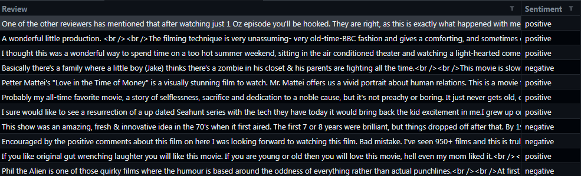

# Project Details

**There are two headers in the dataset :**
- Review: Comments made about the movie. 
- Sentiment: Whether the comment made is positive or negative.

We train this data set with the **random forest** algorithm. As input, it tells us whether the sentences we enter into the program are positive or negative. 
**More details are in the code.**